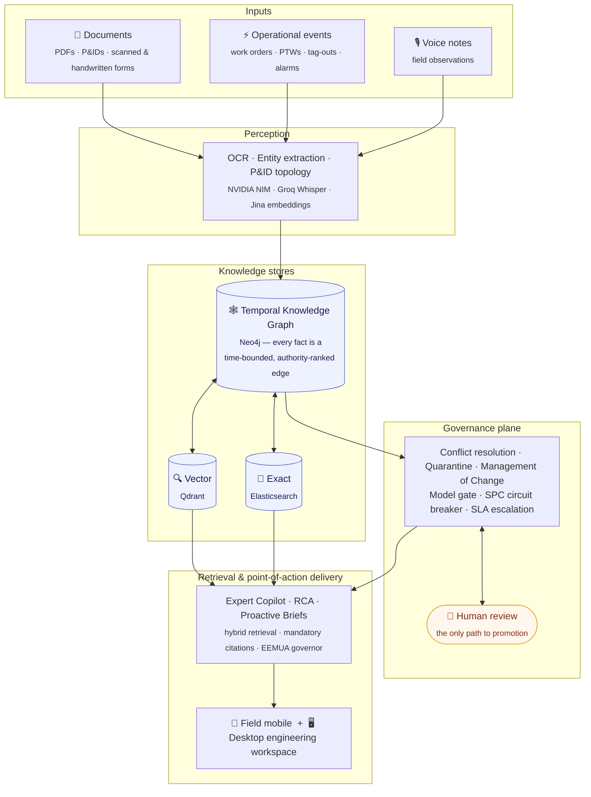

<div align="center">
  
</div>

<div align="center">

# KAIROS

### Industrial Operational Intelligence Platform


**[Quick Start](#quick-start)** · **[How It Works](#how-it-works)** · **[Architecture](./docs/ARCHITECTURE.md)** · **[Documentation](#documentation)**

</div>

---

## Overview

Asset-intensive facilities — refineries, plants, pipelines, power stations — run on knowledge scattered across a dozen disconnected systems. P&IDs live in one archive, maintenance history in another, standard operating procedures in a third, inspection records and regulatory filings elsewhere again. A technician standing in front of a failing pump cannot see that the same seal failed twice before, that the OEM revised the spec eighteen months ago, or that an isolation valve is overdue for inspection. The most dangerous gaps are the ones nobody knows to query — and a quarter of the experienced engineers who hold that context in their heads are retiring within the decade.

**KAIROS** turns that fragmented, tribal knowledge into a single **governed, temporal knowledge graph** and delivers the right information to the right person at the exact moment it is needed — *proactively*, with a source citation behind every claim. It ingests heterogeneous documents, extracts and links their entities, records how every fact changes over time, and surfaces answers, briefs, root-cause analyses, and compliance evidence on any device.

Three principles run through the entire platform:

> **Never assert without provenance. Never auto-promote unverified input. Refuse rather than hedge on a safety-critical question.**

Those are not slogans — they are enforced in the data model (every fact is an edge that carries its own authority and verification status), in the ingestion pipeline (low-confidence extractions are quarantined for a human, never silently trusted), and in the copilot (safety-critical queries return an explicit refusal card instead of a plausible guess).

## How It Works

At its core KAIROS is a pipeline: raw industrial artifacts go in one end, and governed, cited, point-of-action intelligence comes out the other. Between them sits a knowledge graph that remembers not just *what* is true but *when* it was true and *how sure* we are.



1. **Ingest & perceive.** Documents, events, and voice notes enter through one gate. OCR and NER lift entities — equipment tags, process parameters, regulatory clauses, people, dates — out of unstructured text; P&ID drawings are parsed into a connected topology. Files are stored byte-for-byte in an immutable, SHA-256-deduplicated vault.
2. **Link into the graph.** Extracted facts become **edges** in a temporal knowledge graph. Each edge carries six governance properties — validity window, authority level, source document, confidence, verification status — so the graph can answer *what was known on any past date* and show how a fact was later superseded.
3. **Govern.** Nothing unverified reaches an operator by accident. Contradictions surface as conflicts (administrative ones resolve in-app; engineering ones route through Management of Change); low-confidence extractions sit in a one-way quarantine that only a human can promote; an SPC circuit breaker halts ingestion for an asset class whose override rate spikes; a model gate blocks extraction models that fail a precision/recall bar.
4. **Retrieve & deliver.** The copilot answers questions with hybrid retrieval (graph + vector + exact) and mandatory citations, refusing outright on safety-critical parameters. Operational events assemble **proactive briefs** — governed by an EEMUA-191 push ceiling so operators are never flooded — and everything reaches the field on a mobile-first, offline-capable interface built from the same component set as the desktop workspace.

For the full design — the 13-layer breakdown, knowledge-graph mechanics, OT virtualization, and the dual-track governance model — see **[docs/ARCHITECTURE.md](./docs/ARCHITECTURE.md)**.

## Key Capabilities

- **Universal document ingestion** — PDFs, engineering drawings, scanned/handwritten forms, and multi-script (Hindi / Hinglish) text flow through an OCR → NER → graph-linking → indexing pipeline into an immutable, deduplicated vault.
- **Temporal knowledge graph** — every fact is a time-bounded edge with authority, provenance, confidence, and verification status; query the past, watch knowledge get superseded, never lose history.
- **Expert copilot** — hybrid retrieval with citations, confidence scores, phase-gated synthesis, and explicit refusal on safety-critical queries — on mobile for technicians, not just desktops for engineers.
- **Proactive briefs** — events (work orders, PTWs, tag-outs, inspections, alarms) assemble contextual briefs, rate-limited by an EEMUA-191 governor and suppressed by plant state.
- **Maintenance & RCA intelligence** — fuses work-order history, failure records, OEM manuals, and inspection findings into root-cause timelines and hypotheses, with a blast-radius view of everything a change affects.
- **Governed accuracy** — dual-track conflict resolution, human-only quarantine promotion, Management-of-Change, SLA escalation, an SPC circuit breaker, and a model gate.
- **Compliance cockpit** — regulatory clauses (OISD, ISO 45001, Factory Act, PESO) mapped against current procedures, automatic gap detection, and human-signed audit-evidence packs.
- **Knowledge capture at the cliff** — micro-interviews and voice capture pull undocumented expertise out of departing experts before it walks out the door.

## Architecture

KAIROS is a 13-layer platform spanning perception, knowledge modelling, retrieval, governance, and delivery. A FastAPI core orchestrates five datastores, durable Temporal workflows, Celery workers, and Go OT connectors, with a Next.js interface on top. The [mermaid diagram above](#how-it-works) is the birds-eye view; the [architecture document](./docs/ARCHITECTURE.md) is the full blueprint.

| Plane | What lives here |
|---|---|
| **Perception** | OCR, NER, P&ID topology extraction, speech-to-text |
| **Knowledge** | Temporal graph (Neo4j) + vector (Qdrant) + exact (Elasticsearch), kept in sync |
| **Governance** | Conflicts, quarantine, Management of Change, model gate, circuit breaker, SLA |
| **Retrieval & synthesis** | Copilot, RCA, brief assembly, hybrid retrieval, EEMUA governor |
| **Delivery** | Next.js field-mobile + desktop workspace, offline-capable |

## Tech Stack

| Layer | Technology |
|---|---|
| **Backend** | FastAPI (Python 3.12), Temporal (durable workflows), Celery (task queues), Go (Gin) OT connectors |
| **Datastores** | Neo4j (graph), Qdrant (vector), Elasticsearch (exact), Redis (streams/cache), Supabase (Postgres · Auth · Storage) |
| **AI models** | NVIDIA NIM (LLM · NER · OCR), Groq Whisper (STT), Jina (embeddings) — cloud-only, no local model weights |
| **Frontend** | Next.js 16, React 19, Tailwind CSS v4, TypeScript (strict) |
| **Platform** | Docker Compose, OPA (authz), Vault (secrets), OpenTelemetry → Grafana / Prometheus / Tempo |

## Quick Start

The entire stack runs inside Docker — no local Python, Node, or Go required.

**Prerequisites:** Docker Desktop · Make

```bash
# 1. Clone and configure
git clone https://github.com/kr1shnasomani/kairos.git
cd kairos
cp .env.example .env          # add cloud keys (NIM, Groq, Supabase) when ready

# 2. Boot the full platform
make dev

# 3. Initialize datastores and seed reference data (first run, or after `make nuke`)
make init-all
make seed                     # regulatory framework + demo users

# 4. Load the golden demo dataset (optional but recommended)
make load-dataset             # ingest the sample corpus through the real pipeline
#   make load-dataset ARGS=--fast   # structured backbone + events only (fast)
```

Then open the frontend at **[http://localhost:3000](http://localhost:3000)**.

To reset to a clean, deterministic state at any time: `make nuke && make dev && make init-all && make seed && make load-dataset`.

## Local URLs

| Service | URL | Credentials (dev) |
|---|---|---|
| **Frontend** | [localhost:3000](http://localhost:3000) | see demo users below |
| **API docs (FastAPI)** | [localhost:8000/docs](http://localhost:8000/docs) | — |
| **Neo4j Browser** | [localhost:7474](http://localhost:7474) | `neo4j` / `kairos_dev_password` |
| **Qdrant Dashboard** | [localhost:6333/dashboard](http://localhost:6333/dashboard) | — |
| **Temporal UI** | [localhost:8088](http://localhost:8088) | — |
| **Grafana** | [localhost:3001](http://localhost:3001) | `admin` / `kairos_dev_password` |
| **Vault UI** | [localhost:8200](http://localhost:8200) | Token: `kairos-dev-root-token` |

**Demo users** (seeded by `make seed`, pre-fillable on the login screen):

| Email | Role | Sees |
|---|---|---|
| `admin@kairos.local` | admin | everything, incl. model gate / plant state / MDM |
| `engineer@kairos.local` | engineer | full desktop workspace |
| `field_worker@kairos.local` | field_worker | mobile field app (bottom-tab nav) |

## Repository Layout

KAIROS is a monorepo: a Python backend, a Next.js frontend, a shared demo dataset, and the infrastructure to run it all locally.

```text
kairos/
├── backend/            # Python platform — FastAPI API, Temporal workflows,
│                       #   Celery + Go OT workers, init/seed/dataset scripts
├── frontend/           # Next.js point-of-action web app (field mobile + desktop)
├── dataset/            # Golden demo + benchmark corpus (docs · events · telemetry)
├── db/                 # Neo4j Cypher schema · consolidated Supabase schema · maintenance SQL
├── docs/               # Product & technical documentation (this folder)
├── fixtures/           # Shared mock data (P&ID topology, EAM assets)
├── infra/              # Grafana · OPA · OTEL · Tempo · Temporal configs
├── tests/              # Integration test suite (self-cleaning)
├── docker-compose.yml  # Full local infrastructure
├── Makefile            # Project lifecycle commands
├── AGENTS.md           # Contributor & AI-agent guardrails, conventions, pitfalls
└── README.md
```

Each major area has its own deep-dive in [`docs/`](#documentation).

## Documentation

| Document | Contents |
|---|---|
| [`docs/PROBLEM_STATEMENT.md`](./docs/PROBLEM_STATEMENT.md) | The problem KAIROS solves and how it is judged |
| [`docs/ARCHITECTURE.md`](./docs/ARCHITECTURE.md) | The complete 13-layer platform design |
| [`docs/API.md`](./docs/API.md) | REST API reference |
| [`docs/BACKEND.md`](./docs/BACKEND.md) | Services, workers, data models, config |
| [`docs/INFRA.md`](./docs/INFRA.md) | Containers, ports, data stores, observability, dev commands |
| [`docs/DATABASE.md`](./docs/DATABASE.md) | Schema reference across all five stores |
| [`docs/FRONTEND.md`](./docs/FRONTEND.md) | Routes, components, API wiring, auth flow |
| [`docs/FIXTURES.md`](./docs/FIXTURES.md) | Mock-data fallbacks and the demo-chip contract |
| [`docs/DATASET.md`](./docs/DATASET.md) | The golden demo corpus and how to load it |
| [`docs/TESTS.md`](./docs/TESTS.md) | Integration test suite and data hygiene |
| [`AGENTS.md`](./AGENTS.md) | Contributor guardrails, conventions, and pitfalls |

## Development

```bash
# Backend integration tests (stack must be running)
docker exec kairos-backend-api python -m pytest tests/ -q --timeout=120

# Remove integration-test residue from the databases
make purge-test-data

# Frontend checks (from frontend/)
npx tsc --noEmit && npm run lint && npm run build
```

The test suite cleans up after itself — every test-created entity is purged at the end of the session (see [`docs/TESTS.md`](./docs/TESTS.md)). CI runs typecheck, lint, build, and dependency audit on every change.

## License

Private — KAIROS Platform
